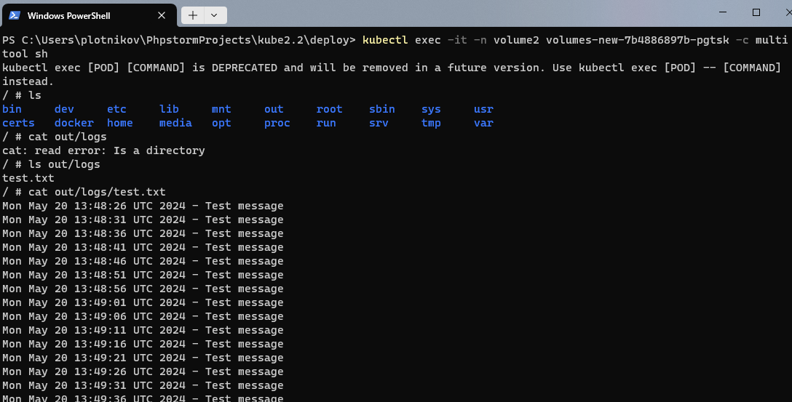
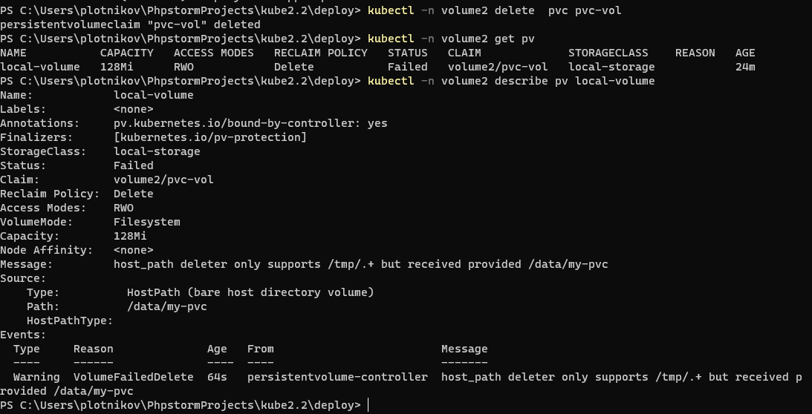
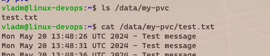
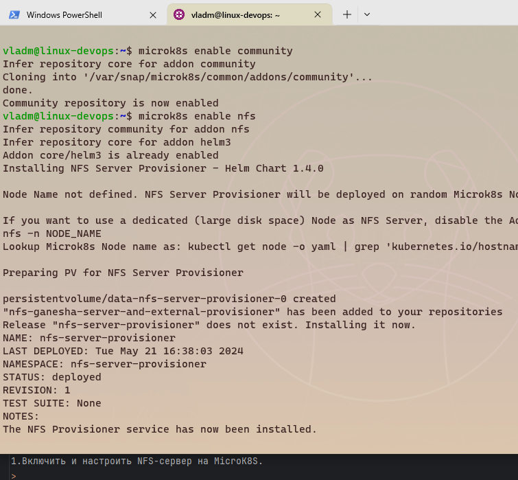
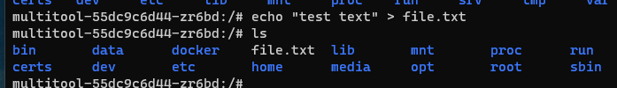
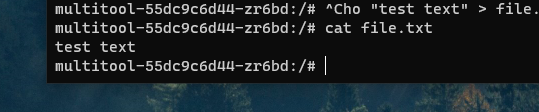

# Домашнее задание к занятию 
«Хранение в K8s. Часть 2»

### Задание 1

**Создать Deployment приложения, использующего локальный PV, созданный вручную.**

1.Создать PV и PVC для подключения папки на локальной ноде, которая будет использована в поде.

>[pv.yaml](deploy%2Fpv.yaml) \
>[pvc.yaml](deploy%2Fpvc.yaml)

2.Продемонстрировать, что multitool может читать файл, в который busybox пишет каждые пять секунд в общей директории.

>

3.Удалить Deployment и PVC. Продемонстрировать, что после этого произошло с PV. Пояснить, почему.

>
> PV изменил состояние на Failed, данные(/data/my-pvc) не удалены, так как они не в /tmp.  

4.Продемонстрировать, что файл сохранился на локальном диске ноды. Удалить PV. Продемонстрировать что произошло с файлом после удаления PV. Пояснить, почему.
>\
>После удаление так же все осталось, демонстрировать нечего (второй такой же скрин нет смысла добавлять)\
> \
>А сохранился файл потому что так устроена работа контроллера PV с hostPath. \
> \
>Чтобы удалилось при удаление PV необходима политика **persistentVolumeReclaimPolicy** со значением **Recycle**.

5.Предоставить манифесты, а также скриншоты или вывод необходимых команд.
>[deployment.yaml](deploy%2Fdeployment.yaml)\
>[pv.yaml](deploy%2Fpv.yaml) \
>[pvc.yaml](deploy%2Fpvc.yaml)

### Задание 2

1.Включить и настроить NFS-сервер на MicroK8S.
>

2.Создать Deployment приложения состоящего из multitool, и подключить к нему PV, созданный автоматически на сервере NFS.
>[deployment-nfs.yaml](deploy%2Fdeployment-nfs.yaml) \
>[pvc-nfs.yaml](deploy%2Fpvc-nfs.yaml) 

> Продемонстрировать возможность чтения и записи файла изнутри пода.\
> Возможность записи:
> 
> Возможность чтения:
> 

Предоставить манифесты, а также скриншоты или вывод необходимых команд.
> [pvc-nfs.yaml](deploy%2Fpvc-nfs.yaml)\
> [deployment-nfs.yaml](deploy%2Fdeployment-nfs.yaml)